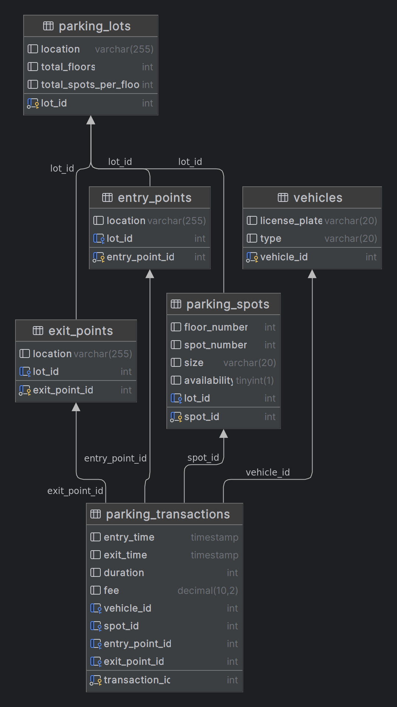
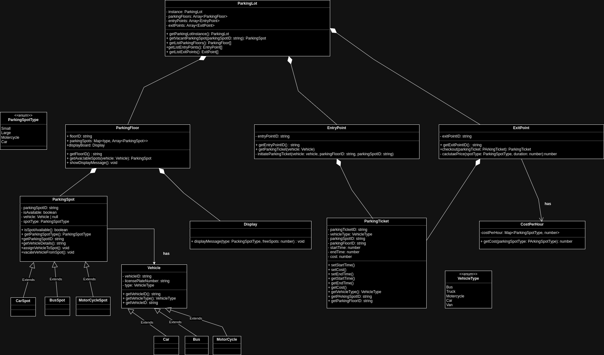

# Parking Lot Low Level System Design

Low-level architecture for a backend system of a smart parking lot, handles vehicle entry and exit management, parking space allocation, and fee calculation.

# Data Model

### 1. Parking Lot:

**Attributes:**

- lot_id (primary key)
- location
- total_floors
- total_spots_per_floor

### 2. Parking Spot:

**Attributes:**

- spot_id (primary key)
- floor_number
- spot_number
- size
- availability
- lot_id (foreign key)

### 3. Vehicle:

**Attributes:**

- vehicle_id (primary key)
- license_plate
- type

### 4. Transaction:

**Attributes:**

- transaction_id (primary key)
- entry_time
- exit_time
- duration
- fee
- vehicle_id (foreign key)
- spot_id (foreign key)
- entry_point_id (foreign key)
- exit_point_id (foreign key)

### 5. Entry Point:

**Attributes:**

- entry_point_id (primary key)
- location
- lot_id (foreign key)

### 6. Entry Point:

**Attributes:**

- exit_point_id (primary key)
- location
- lot_id (foreign key)

#### Database Diagram

## Parking Lot System

## Algorithm for Spot Allocation

- When a vehicle enters, the system checks for available spots on the corresponding floor based on the vehicle size.
- Use a priority queue to efficiently find the closest available spot for the given size.
- Update the spot's availability status in real-time.

## Fee Calculation Logic

- Calculate the duration of stay based on the entry and exit times.
- Formula: TotalCost = (BaseFee + AdditionalFee) \* Duration.
  - BaseFee : Cost per hour based on type of vehicle
  - Duration : Calculate from start time (Entry Point) and end time (Exit Point)

## Concurrency Handling

- Update availability of parking spots in real time.
- Use tickets to update the record with check-in and check-out of vehicle at each entry/exit points.
